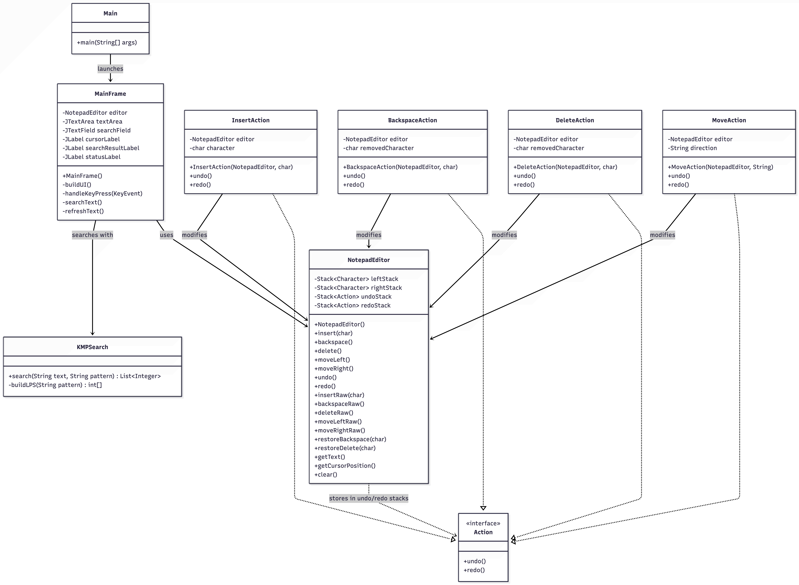
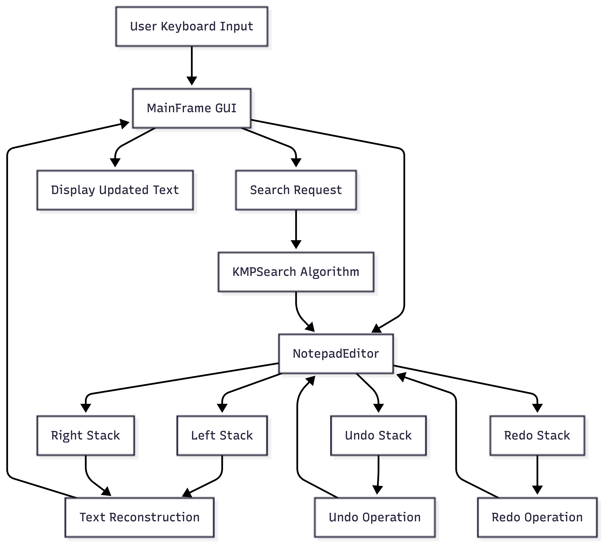

# DSAA204 Notepad

A simplified Notepad application built in Java for the DSAA204 Data Structures and Algorithms unit.

The objective of this project was to implement common text editor functionality using custom data structures and algorithms rather than relying on Java's built-in text editing behaviour. The application demonstrates stack-based text editing, undo/redo functionality, efficient cursor movement, and text searching using the Knuth-Morris-Pratt (KMP) algorithm.

## Features

- Character insertion at the current cursor position
- Backspace support
- Delete support
- Left and right cursor movement
- Undo operations
- Redo operations
- Text search using the KMP algorithm
- Java Swing graphical user interface
- Automated test suite
- UML and architecture documentation

## Project Structure

```text
.
├── docs
│   ├── complexity-analysis.md
│   └── diagrams
│       ├── architecture-diagram.png
│       └── uml-class-diagram.png
├── src
│   ├── actions
│   │   ├── Action.java
│   │   ├── BackspaceAction.java
│   │   ├── DeleteAction.java
│   │   ├── InsertAction.java
│   │   └── MoveAction.java
│   ├── editor
│   │   └── NotepadEditor.java
│   ├── gui
│   │   └── MainFrame.java
│   ├── search
│   │   └── KMPSearch.java
│   └── Main.java
├── test
│   └── NotepadEditorTest.java
└── README.md
```

## Diagrams

### UML Class Diagram



### Architecture Diagram



## System Design

The application follows a simple layered design.

```text
User Input
    ↓
MainFrame (GUI)
    ↓
NotepadEditor
    ↓
Stacks + Actions
    ↓
Search (KMP)
```

The GUI handles user interaction while the editor manages all editing operations. This keeps the user interface separate from the underlying logic.

## Two-Stack Text Buffer

The editor is built around two stacks.

```text
Left Stack | Cursor | Right Stack
```

Characters before the cursor are stored in the left stack while characters after the cursor are stored in the right stack.

Moving the cursor left transfers a character from the left stack to the right stack.

Moving the cursor right transfers a character from the right stack to the left stack.

This design allows insertion, deletion and cursor movement operations to execute efficiently.

## Undo and Redo

Undo and redo functionality are implemented using separate action history stacks.

Whenever a user performs an operation, an action object is pushed onto the undo stack.

- Undo transfers actions from the undo stack to the redo stack.
- Redo replays actions from the redo stack and moves them back to the undo stack.

This approach provides efficient action history management while keeping the implementation modular.

## Search Algorithm

Search functionality uses the Knuth-Morris-Pratt (KMP) string matching algorithm.

KMP was chosen because it avoids unnecessary character comparisons and provides efficient pattern searching with a time complexity of:

```text
O(n + m)
```

where:

- n = length of the text
- m = length of the search pattern

Example:

```text
Text: hello world hello
Pattern: hello

Matches: [0, 12]
```

## Complexity Summary

| Operation | Complexity |
|------------|------------|
| Insert Character | O(1) |
| Backspace | O(1) |
| Delete | O(1) |
| Move Cursor Left | O(1) |
| Move Cursor Right | O(1) |
| Undo | O(1) |
| Redo | O(1) |
| Search (KMP) | O(n + m) |
| Display Text | O(n) |

## Running the Application

Compile:

```bash
javac -d out src/Main.java src/editor/*.java src/actions/*.java src/search/*.java src/gui/*.java
```

Run:

```bash
java -cp out Main
```

## Running Tests

Compile:

```bash
javac -d out src/editor/*.java src/actions/*.java src/search/*.java test/*.java
```

Run:

```bash
java -cp out NotepadEditorTest
```

Expected output:

```text
Passed: 15
Failed: 0
```

## Test Coverage

The automated test suite covers:

- Character insertion
- Backspace operations
- Delete operations
- Cursor movement
- Insertion in the middle of text
- Undo operations
- Redo operations
- Search functionality
- Search edge cases
- Action history behaviour

## Documentation

Additional project documentation:

- [Complexity Analysis](docs/complexity-analysis.md)
- [UML Class Diagram](docs/diagrams/uml-class-diagram.png)
- [Architecture Diagram](docs/diagrams/architecture-diagram.png)

## Authors

DSAA204 Group Project

Kent Institute Australia

Data Structures and Algorithms
